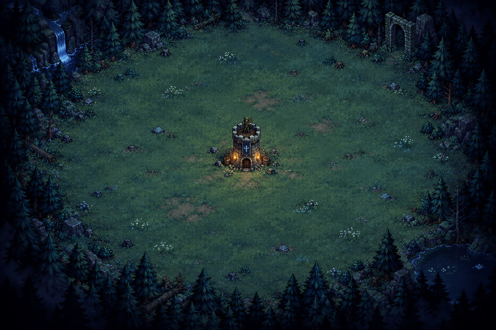

# 森林守望・注音魔法師

以注音打字施放魔法，守護黑暗森林中的王國箭塔。這是一款為剛開始學習鍵盤的七年級學生設計的單機網頁遊戲，採用 2D 俯視像素風與無時間上限的生存挑戰。

🎮 **[直接遊玩](https://peicheng0413.github.io/forest-watch-zhuyin/)**

請使用電腦與實體鍵盤，並先切換為**英文輸入法**。不需要安裝、註冊或登入。



## 故事劇情

你原本只是坐在鍵盤前，卻被異世界的賢者召喚到王國邊境。黑暗森林中的哥布林與獸人正逼近箭塔，而賢者正在尋找能解讀古老文字的人。

他遞來一張卷軸。陌生的筆跡，竟藏著你熟悉的「ㄇㄛˊ ㄈㄚˇ ㄕㄡˇ ㄏㄨˋ」——魔法守護。在你的世界，它們是注音；在這裡，它們是能與靈魂共鳴的魔法文字。

每個生物的靈魂都有真名。賢者透過「靈魂鑑定」使真名顯現，而這片森林的魔物，真名恰好由注音構成。你擔任真名解讀者，以鍵盤將名字傳給邊境魔法師。每一次正確輸入，都讓魔法師能準確施展中毒、石化、燃燒或混亂，支援塔上自動迎敵的王國弓箭手。

魔物被擊敗後留下魔石，逐步累積能量。魔杖蓄滿後發光抖動。輸入列空白時連按兩下空白鍵，才會啟動吟唱並讓戰場暫時凝結。你解讀完整的注音咒語，魔法師便能喚來「曙光降臨」，清除場上魔物。直到箭塔生命耗盡，你的守望才會結束。

### 開場序章：賢者的召喚

進入網頁會先呈現四段故事：異界召喚、卷軸文字的揭示、靈魂真名、共同守護邊境。閱讀期間不生成敵人、不計算存活時間；可前後翻頁、略過故事，或在開始畫面重讀序章。讀完後先進入操作說明，按「開始守護」才開戰。

卷軸使用使用者提供的「魔法守護」成品，保留完整圖片。圖中字型與紙張設計為**做作的Daphne**，轉換網站由 **justfont** 提供技術支援：[精靈文字體轉換器](https://justfont.com/justforfun/elf-bpmf)。遊戲與該網站沒有合作或背書關係；本專案不包含字型檔。

## 玩法與操作

畫面中央為箭塔，外圍是草地與森林，四角帶有暗角。哥布林與獸人從四周逼近，抵達箭塔後會持續攻擊。弓箭手自動攻擊最近的魔物；玩家負責用注音施法支援。

| 按鍵 | 功能 |
| --- | --- |
| 標準注音對應的英文字母、數字、標點鍵 | 輸入魔物名字，畫面即時轉成注音 |
| Tab 或 ← / → | 切換法術，保留目前輸入；Tab 只正向循環 |
| Enter | 送出名字或咒語；錯誤時清空輸入 |
| 空白鍵 × 2 | 魔杖蓄滿且輸入列空白時，連按兩次進入注音咒語模式 |
| Backspace | 刪除最後一個符號 |
| Esc | 暫停／繼續 |

- 怪物只顯示注音名字，不提供螢幕鍵盤。
- 一聲明確顯示「ˉ」，且必須按空白鍵；二、三、四聲及輕聲都需要輸入。
- 例如 `g0` 加空白鍵為「山」的一聲，`su3` 會顯示為 `ㄋㄧˇ`，`gjo3` 會顯示為 `ㄕㄨㄟˇ`。
- 雙字詞依序輸入各音節與聲調；每個一聲音節都必須按空白鍵，其他聲調不需額外分隔，也不需要選國字。
- 不需鎖定敵人。輸入任一魔物完整真名並按 Enter，法術命中名字相符的魔物；若同名，所有同名魔物一起受到目前法術影響，一次送出計一次成功施法。
- 輸入期間，符合前綴的名字會亮起；沒有相符名字時會顯示提示。出怪與怪物死亡不會清除輸入。送出時沒有相符的存活魔物，會提示並清空。
- 戰鬥中 Tab 正向循環四種法術並保留輸入；Shift + Tab 不切換法術，維持網頁焦點操作。故事、暫停與吟唱期間 Tab 也保留網頁操作。
- 離開分頁會自動暫停。畫面也提供全螢幕與可開關的合成音效。

## 四種靈魂法術

| 法術 | 目前效果 | 用途 |
| --- | --- | --- |
| 中毒 | 持續 10 秒，每秒 6 點傷害 | 提前削弱敵人 |
| 石化 | 停止移動與攻擊 4.5 秒 | 阻擋逼近或正在攻塔的敵人 |
| 燃燒 | 持續 3.5 秒，每秒 13 點傷害 | 快速處理危險敵人 |
| 混亂 | 持續 6 秒，轉而接近並攻擊其他魔物 | 利用怪群互相傷害 |

法術沒有冷卻時間。同種效果再次施放會刷新時間，傷害不疊倍；不同效果可以並存。石化期間中毒與燃燒仍會造成傷害；混亂的怪物若沒有其他目標，暫時停止行動。

## 魔石、大魔法與難度

每隻魔物消散後自動獲得一顆魔石，魔石飛向右下角魔杖，周圍的光由下往上累積。集滿 **12 顆**後魔杖發光抖動，戰鬥與計時繼續，能量保留至施放。輸入列空白時，在 **450 毫秒**內連按兩下空白鍵，才進入咒語模式，完全暫停戰鬥與存活計時。長按不算連按；中途輸入其他按鍵、切換法術、暫停或離開視窗會取消連按判定。輸入名字中的空白鍵仍是一聲「ˉ」，不會觸發大魔法。正確輸入注音咒語並按 Enter 後清場，能量歸零；大魔法清場不回補魔石，避免連續觸發。

開發者詞庫包含 **60 筆單字與雙字詞、3 組咒語**。初期只出現單字，隨存活時間逐步加入雙字詞、獸人，並增加怪物生成頻率與生命值。移動速度有上限。

目前咒語為「光明守護」、「大地之光」與「星火之力」，遊戲僅顯示其注音。

## 成績與紀錄

箭塔生命歸零後結算：

- 存活時間：主要成績，暫停與咒語模式不計時。
- 獲得魔石：整場實際取得的魔石累積數，包含能量滿時取得的魔石，不因施放大魔法歸零；大魔法清場不產生魔石。
- 成功施法次數：包含大魔法。
- 輸入正確率：正確送出次數 ÷ 全部有效送出次數；不計空白送出。Backspace 修正後正確送出不算錯誤。

最佳存活時間與該次成績儲存在瀏覽器 `localStorage`。不同裝置或不同網站來源的紀錄不共用；清除瀏覽器資料也會清除紀錄。沒有雲端帳號、排行榜或學生資料上傳。

## 開發內容

本版使用原生 **HTML、CSS、JavaScript 與 Canvas 2D**，不依賴前端框架或外部套件。背景與角色為 AI 生成的像素素材；使用透明角色圖集呈現八方向弓箭手，魔物改用身體與雙腿分層貼圖，左右腿以相反相位交替步行，音效以 Web Audio API 合成。

| 檔案 | 職責 |
| --- | --- |
| `dist/index.html` | 遊戲畫面、開始／暫停／咒語／結算介面 |
| `dist/style.css` | 橫向電腦版面、響應式介面與狀態樣式 |
| `dist/core.js` | 注音鍵位、詞庫、咒語、真名比對、法術、怪物行為、難度與遊戲狀態 |
| `dist/game.js` | 鍵盤事件、Canvas 繪圖、音效、特效、畫面更新與本地紀錄 |
| `dist/story.js` | 四段序章文案、翻頁與重讀狀態 |
| `dist/assets/magic-guardian-scroll.png` | 使用者提供的「魔法守護」精靈文卷軸，來源見上方 |
| `dist/visuals.js` | 八方向判定、瞄準與放箭動作狀態 |
| `dist/assets/forest-empty-tower.png` | 無人物的森林箭塔背景，供動態弓箭手疊加 |
| `dist/assets/archer-eight-directions.png` | 八方向拉弓／放箭，共 16 格透明角色圖集 |
| `dist/assets/monsters-rig.png` | 新哥布林與獸人的身體、遠腿、近腿透明分層貼圖 |
| `dist/assets/monsters-walk.png` | 舊版圖集，保留歷史素材，不再用於遊戲 |
| `dist/assets/frames.json` | 各影格裁切範圍與腳底落點 |
| `dist/favicon.svg` | 網站圖示 |
| `tests/core.cjs` | 核心遊戲規則回歸測試 |

遊戲邏輯與畫面分開：`core.js` 可在 Node.js 執行測試，也可在瀏覽器載入；`game.js` 負責把遊戲事件呈現為動畫與介面。遊戲透過 `requestAnimationFrame` 更新，戰鬥只在遊玩狀態推進。

### 本機執行

下載或 clone 專案後，直接用瀏覽器開啟 `dist/index.html` 即可遊玩，亦可啟動靜態伺服器：

```sh
python3 -m http.server 8000 --directory dist
```

瀏覽器開啟 `http://localhost:8000`。遊玩不需要 Node.js。

### 驗證

若已安裝 Node.js，可執行：

```sh
node tests/core.cjs
node tests/keyboard.cjs
node tests/visuals.cjs
node tests/feedback.cjs
node tests/story.cjs
node tests/names.cjs
node tests/children.cjs
node --check dist/core.js
node --check dist/game.js
```

測試涵蓋注音鍵位與詞庫、錯字清空、法術並存、真名比對、刪字、暫停、咒語凍結與清場、石化防傷、怪物攻塔、持續傷害魔物消散與遊戲結束。另已用瀏覽器實際檢查鍵盤施法與橫向版面。

### 調整詞庫與平衡

在 `dist/core.js` 的 `WORDS`、`CHANTS` 修改詞語與標準注音鍵序；`SPELLS` 與 `Game.update()` 管理法術持續時間和傷害。怪物生成與難度參數位於 `Game.spawn()` 及 `Game.update()`。修改後請重新執行核心測試。

### GitHub Pages

`main` 分支保存完整原始碼、說明與測試；`gh-pages` 分支放置 `dist/` 的靜態內容，從分支根目錄發布。更新遊戲時需要同步更新 `gh-pages` 分支。

## 版本範圍

目前為可試玩的單機第一版，已完成注音施法、四種法術、哥布林與獸人、自動弓箭手、魔石咒語、無限生存難度與成績紀錄。法術平衡、出怪節奏與詞庫可依實際教室試玩再調整。

最初曾討論老師主機與區域網路連線對戰，第一版已改為單機，因此目前沒有房間、WebSocket 或多人同步功能。

### v1.0.3 操作修正

遊玩與吟唱期間攔截 Tab 預設焦點切換；暫停後 Tab 恢復一般網頁操作。左右鍵與 Tab 優先於輸入法組字檢查處理。一聲在怪物、咒語及輸入區皆顯示「ˉ」。靜態程式附帶版本參數，避免更新後沿用舊快取。

### v1.1.0 角色與射箭動畫

- 弓箭手依實際射擊目標切換東、東南、南、西南、西、西北、北、東北八種朝向；射擊前拉弓，射擊時切換放箭姿勢，箭矢從弓旁朝目標飛行。
- 哥布林更新為尖耳、皮甲、短刀與木盾造型；獸人更新為獠牙、角盔、重肩甲與巨斧，體型較大。
- 魔物使用四影格步行動畫，依行進方向左右翻轉。石化停止步行並呈現灰白石化色；暫停與吟唱時人物動作停止。
- 角色與注音標籤補償戰場比例，避免寬螢幕下被壓扁。素材載入完成後才允許開始。
- 八方向、箭矢起點、拉弓與放箭、暫停凍結、素材界線與原有玩法皆有測試。

素材使用內建 imagegen 產生；透明 PNG 保留原始 alpha，遊戲在執行時依圖集座標裁切，未增加外部素材或執行時服務依賴。

### v1.2.0 待機動作與施法回饋

- 弓箭手未拉弓或放箭時會呼吸、輕微擺動；腳底固定於塔頂。拉弓、放箭期間停用待機擺動，暫停與咒語模式會凍結動作。
- 成功施法時，魔物短暫亮起，腳下出現法術光圈，並呈現各法術不同的泡泡、碎石、火星或旋轉粒子。
- 魔物下方顯示「中毒命中」等提示；重複施放同一法術顯示「刷新」。字幕追蹤命中的原怪物，切換目標後不會跑到新目標。
- 輸入區上方顯示 1.8 秒成功提示，下方保留法術名稱及目標注音；輸入框與法術按鈕短暫亮起，不會阻擋繼續打字。
- 開啟音效後，施法會播放三音確認聲。音效關閉時，文字與視覺回饋仍完整呈現。
- 尊重系統的減少動態效果設定，降低待機擺動與瞬間亮起效果，保留成功文字。

### v1.3.0 賢者的召喚

- 新增四段可翻頁、略過與重讀的開場故事，串起異界召喚、注音魔法文字與靈魂真名。
- 使用「魔法守護」卷軸，在第二段揭示熟悉的注音讀法，並標示素材來源。
- 明確區分賢者、真名解讀者、魔法師與弓箭手的合作關係，同步調整遊戲提示。
- 故事使用原生模態對話框，支援鍵盤操作；閱讀時停止戰鬥與計時，響應式排版與減少動態效果設定均受支援。
- 新增序章狀態與遊戲凍結測試，並以瀏覽器驗證完整閱讀、重讀、略過和開始遊戲流程。

### v1.4.0 魔杖蓄光與主動吟唱

- 右下角新增水晶魔杖，成功施放四種法術時，杖尖呈現對應色光環與揮動；大魔法完成時呈現金色光環。
- 原本上方魔石能量條改成魔杖周圍由下往上累積的光，保留數字進度。滿能量時發光、輕微抖動並提示「空白鍵 × 2」。
- 滿能量不再自動打斷戰鬥。空白輸入列連按兩下空白鍵才進入原有注音咒語流程，完成後清場、能量歸零。
- 減少動態效果設定會停止抖動與揮動，保留能量光與施法提示；暫停期間停止滿能量抖動。
- 已驗證連按時間窗、長按、一聲、切換控制、暫停、輸入法中斷，以及吟唱凍結與能量消耗。

### v1.5.0 以真名指定魔物

- 移除自動鎖定、Tab 選怪與選取光圈。輸入完整注音後按 Enter，直接匹配場上的存活魔物。
- 輸入前綴符合的名字會亮起，輸入區顯示符合數量、完整吻合或無相符真名。同名時每次優先命中距離箭塔最近的一隻。
- 出怪或魔物死亡不打斷輸入；送出時無相符魔物會清空並計入錯誤。空白輸入不計入嘗試。
- 左右鍵切換法術、一聲空白鍵、魔杖蓄光與雙空白吟唱均保留。弓箭手仍自動攻擊最近魔物。
- 新增真名比對回歸測試，並用瀏覽器驗證前綴亮起與直接施法命中遠處魔物。

### v1.6.0 同名共鳴、分層動畫與魔石紀錄

- 同名魔物全部受到法術影響，各自顯示狀態特效，一次輸入只計一次成功施法。Tab 正向切換法術，未加入 Shift + Tab 反向切換；左右鍵功能保留。
- 重新生成哥布林與獸人素材。改用固定身體與武器、雙腿反相擺動的分層動畫，避免同腳重複踏步與武器跳動。石化停止步行，暫停與吟唱凍結動作。
- 以箭塔為主要光源，距離越遠越暗，朝向中心的一面暖亮、背面偏暗，地面陰影向外延伸。光影只套用角色透明輪廓，注音名字保持可讀。
- 移除右下角戰場統計，魔杖下移靠近右下角。結算改為「獲得魔石」，新局重設、累積不受能量消耗影響。
- 新增同名群體施法、魔石累計、雙腿交替與中心光源測試；瀏覽器驗證群體石化、Tab 保留輸入、結算顯示。
